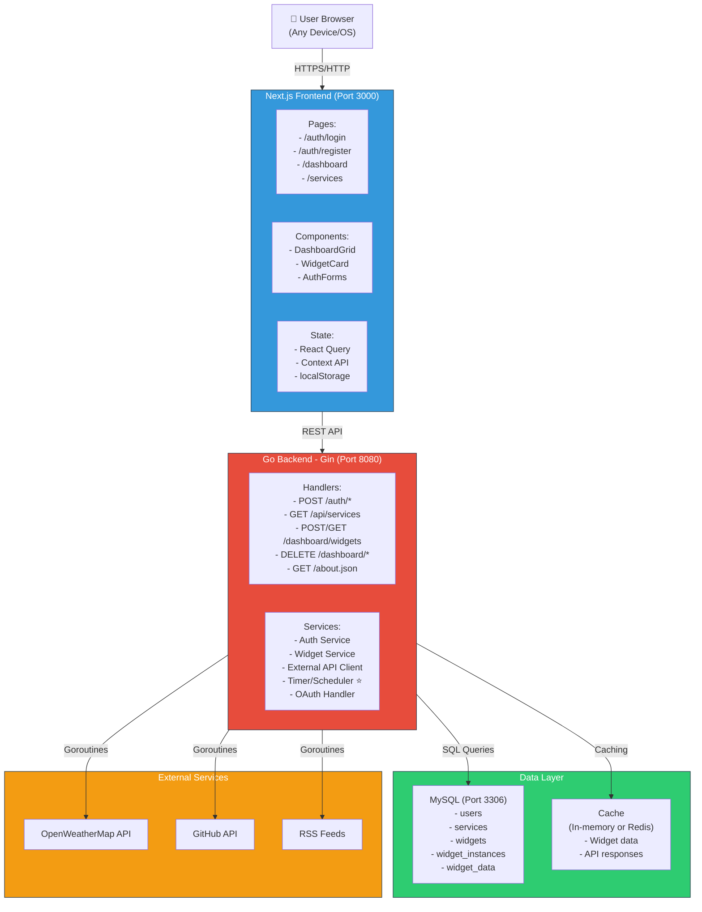
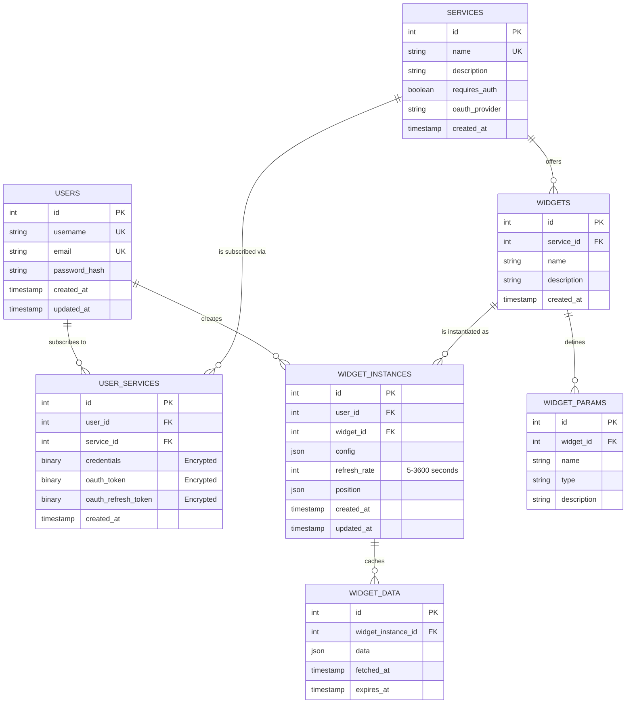

# Development Specification
## Epitech Dashboard Project

**Version:** 1.0
**Date:** September 2024
**Team Size:** 2 people (Backend-focused)
**Status:** Active Development

---

## 1. Executive Summary

### Project Overview
The Epitech Dashboard is a customizable real-time information aggregation platform. Authenticated users can subscribe to external services (weather, GitHub, RSS feeds) and create a personalized dashboard with drag-and-drop widgets. Each widget displays live data from a configured service and automatically refreshes at user-defined intervals.

### Key Objectives
- Users can register, authenticate, and securely manage their account
- Users can subscribe to multiple services (with OAuth for secure external API access)
- Users can create and configure widget instances with dynamic parameters
- Dashboard supports drag-and-drop widget positioning and sizing
- Widgets automatically refresh at configurable intervals (5-3600 seconds)
- Application complies with Epitech requirements (Docker, `/about.json` endpoint)

### Success Criteria (Epitech G-EPI-G-400)
- Application launches with `docker-compose up`
- Backend server runs on port 8080
- `/about.json` endpoint returns accurate service and widget metadata
- Minimum support: 3 services (1+X where X=2) and 6 widgets (3×X)
- Responsive UI with accessibility features
- Real-time widget refresh via timer mechanism
- Secure authentication (JWT + bcrypt)
- OAuth integration for external service authorization

### Team Composition
- **Backend Developer:** Janumaruku (Go/Goroutines, Timer Scheduler, API Architecture)
- **Frontend Developer:** TBD (Next.js, UI Components, State Management)
- **Estimated Timeline:** 6 weeks

### Delivery Artifacts
- Source code (all languages, no binaries)
- README.md with setup & usage instructions
- docker-compose.yml
- Database migrations
- API Specification (separate document)
- Frontend Specification (separate document)
- Tech Stack Analysis (separate document)

---

## 2. Use Cases

### Use Case Diagram

```mermaid
usecase-beta
actor Customer as "User"
actor Admin

systemBoundary Dashboard {
usecase UC1 as "Register Account"
usecase UC2 as "Login to Dashboard"
usecase UC3 as "Browse Services"
usecase UC4 as "Subscribe to Service"
usecase UC5 as "Create Widget Instance"
usecase UC6 as "Configure Widget"
usecase UC7 as "Manage Dashboard"
usecase UC8 as "View Widget Data"
usecase UC9 as "Manage Services"
usecase UC10 as "Monitor System"
}

Customer --> UC1
Customer --> UC2
Customer --> UC3
Customer --> UC4
Customer --> UC5
Customer --> UC6
Customer --> UC7
Customer --> UC8

Admin --> UC9
Admin --> UC10

UC2 ..|> UC1 : includes
UC3 ..|> UC2 : includes
UC4 ..|> UC3 : includes
UC5 ..|> UC4 : includes
UC6 ..|> UC5 : includes
UC7 ..|> UC6 : includes
UC8 ..|> UC7 : includes
```

### Use Case Descriptions

#### UC1: Register Account

**Objective**
Create a new user account to access the dashboard.

**Actor**
New user (unauthenticated)

**Context**
The user arrives on the homepage and wants to create an account to access their personalized dashboard.

**Input Data**
- Username (3-50 characters, alphanumeric + underscore)
- Email address (valid format)
- Password (at least 8 characters, uppercase, lowercase, digit, special character)

**Preconditions**
- No existing account with this username
- No existing account with this email
- Registration page accessible

**Postconditions**
- Account created in the database
- Password hashed with bcrypt
- User automatically logged in (JWT generated)
- Redirect to dashboard

**Output Data**
- JWT token (active session)
- User information (id, username, email)

**Main Scenario**
1. Access the registration page
2. Fill the form (username, email, password)
3. Submit the form
4. Backend validation
5. Account creation
6. JWT token generation
7. Redirect to dashboard

**Alternative Scenarios**
- Username already taken → display "Username already taken"
- Email already registered → display "Email already registered"
- Weak password → display "Password must contain..."
- Invalid email → display "Invalid email format"

---

#### UC2: Login to Dashboard

**Objective**
Authenticate a registered user and grant access to their personal dashboard.

**Actor**
Registered user

**Context**
The user returns to the application and wants to access their dashboard.

**Input Data**
- Email address
- Password

**Preconditions**
- Existing user account
- Login page accessible
- No active session

**Postconditions**
- User authenticated
- JWT token issued
- Active session for 1 hour
- Redirect to dashboard

**Output Data**
- JWT access token
- (Optional) Refresh token
- User information

**Main Scenario**
1. Access the login page
2. Enter email and password
3. Submit the form
4. Verify credentials
5. Hash and compare the password
6. Generate JWT token
7. Return the token and redirect to /dashboard

**Alternative Scenarios**
- Email not found → display "Invalid email or password"
- Incorrect password → display "Invalid email or password"
- Account locked (too many attempts) → display "Account locked"

**Business Rules**
- Max 5 failed attempts per 15 minutes per IP
- JWT expires after 3600 seconds
- Refresh token valid for 7 days

---

#### UC3: Browse Services

**Objective**
Browse the list of available services and their descriptions.

**Actor**
Authenticated user

**Context**
The user wants to discover which services they can integrate into their dashboard.

**Input Data**
- None (GET request)

**Preconditions**
- User authenticated (valid JWT)
- Services page accessible
- Services configured in the database

**Postconditions**
- Service list displayed
- Requirement info shown (auth required yes/no)

**Output Data**
```json
[
   {
      "id": 1,
      "name": "weather",
      "description": "Weather data from OpenWeatherMap",
      "requires_auth": false,
      "oauth_provider": null
   },
   {
      "id": 2,
      "name": "github",
      "description": "GitHub activity and repositories",
      "requires_auth": true,
      "oauth_provider": "github"
   }
]
```

**Main Scenario**
1. User clicks "Services"
2. Frontend calls GET /api/services
3. Backend returns the full list
4. Services displayed with descriptions
5. "Subscribe" or "Already subscribed" buttons shown

**Alternative Scenarios**
- No services available → display "No services available"
- User already subscribed → display "Connected" instead of "Subscribe"

---

#### UC4: Subscribe to Service

**Objective**
Link the user account to an external service (with or without OAuth).

**Actor**
Authenticated user

**Context**
The user wants to enable access to a service in order to create widgets.

**Input Data (OAuth)**
- Service ID
- Authorization code (from GitHub)

**Input Data (No OAuth — Weather)**
- Service ID only

**Preconditions**
- User authenticated
- Service exists
- User not yet subscribed to this service

**Postconditions**
- Subscription created in user_services
- OAuth token encrypted and stored (if applicable)
- Service widgets now available

**Output Data**
- Subscription confirmation
- (Optional) Stored access token

**Main Scenario (Weather — No OAuth)**
1. User clicks "Subscribe" on Weather
2. Frontend POST /api/user-services/1/subscribe
3. Backend creates entry in user_services
4. Weather widgets available immediately
5. Redirect to Widgets page

**Alternative Scenario (GitHub — OAuth)**
1. User clicks "Connect GitHub"
2. Redirect to GitHub login
3. User authorizes permissions
4. Redirect to /auth/callback?code=...
5. Backend exchanges code for access token
6. Token encrypted and stored
7. Redirect to dashboard with confirmation

**Business Rules**
- Weather does not require authentication
- GitHub and RSS require OAuth or a URL
- One user = one subscription per service, max

---

#### UC5: Create Widget Instance

**Objective**
Create a configured widget instance on the dashboard.

**Actor**
Authenticated user, subscribed to the relevant service

**Context**
The user wants to add a widget to their dashboard to visualize data.

**Input Data**
- Widget ID
- Configuration (widget parameters)
- Refresh rate (5-3600 seconds)
- Initial position (x, y, width, height)

**Preconditions**
- User authenticated
- User subscribed to the widget's service
- Valid configuration

**Postconditions**
- Instance created in the database
- Widget visible on the dashboard
- Timer started for automatic refreshes

**Output Data**
```json
{
   "instance_id": 42,
   "widget_id": 5,
   "widget_name": "City Temperature",
   "config": { "city": "Paris", "units": "celsius" },
   "refresh_rate": 300,
   "position": { "x": 0, "y": 0, "w": 2, "h": 2 }
}
```

**Main Scenario**
1. User clicks "Add Widget"
2. Select a service (Weather, GitHub, RSS)
3. Select a widget type (City Temperature, Recent Repos, etc.)
4. Fill the dynamic configuration
5. Set the refresh rate (slider)
6. Click "Add to Dashboard"
7. Widget created and displayed

**Alternative Scenarios**
- Invalid configuration → display validation errors
- Not subscribed to service → display "Subscribe first"
- Config parameter mismatch → display "Invalid parameter type"

**Business Rules**
- Min 5s, max 3600s for refresh_rate
- Config must match the widget's parameters
- Position x, y >= 0

---

#### UC6: Configure Widget

**Objective**
Modify the configuration of an existing widget instance.

**Actor**
Authenticated user (widget owner)

**Context**
The user wants to modify the parameters or refresh rate of a widget.

**Input Data**
- Widget Instance ID
- New configuration (partial or complete)
- (Optional) New refresh_rate
- (Optional) New position

**Preconditions**
- Widget instance belongs to the user
- Valid configuration
- User authenticated

**Postconditions**
- Configuration updated
- Widget redisplays with new data

**Output Data**
- Updated widget instance

**Main Scenario**
1. User clicks widget → "Edit" icon
2. Configuration form opens
3. Modify parameters (e.g., city = "London")
4. Click "Save"
5. Backend updates
6. Widget redisplays with new data

**Alternative Scenarios**
- Invalid config → display "Invalid configuration"
- Widget belongs to another user → display "Unauthorized"

---

#### UC7: Manage Dashboard

**Objective**
Organize and manage dashboard widgets (move, delete, resize).

**Actor**
Authenticated user

**Context**
The user wants to reorganize their dashboard according to their preferences.

**Input Data**
- Widget Instance ID
- (For move) New position (x, y, w, h)
- (For delete) Confirmation

**Preconditions**
- Widget belongs to the user
- Valid position (x, y >= 0)

**Postconditions**
- Position updated in DB, or widget deleted
- Layout readjusted

**Output Data**
- No data returned (200 OK status)

**Main Scenario (Drag & Drop)**
1. User drags widget on dashboard
2. Position updated in real time (frontend)
3. On drop → PUT /dashboard/widgets/:id {position}
4. Backend updates position
5. Confirmation

**Alternative Scenario (Delete)**
1. User clicks "Delete" button on widget
2. Confirmation modal
3. DELETE /dashboard/widgets/:id
4. Backend deletes widget
5. Layout readjusted

**Business Rules**
- Position x, y must be >= 0
- No limit on widgets per user
- Deletion is immediate (no restore)

---

#### UC8: View Widget Data

**Objective**
Display up-to-date widget data on the dashboard.

**Actor**
Authenticated user

**Context**
The user looks at their dashboard and sees near real-time data.

**Input Data**
- Widget Instance ID (indirect)

**Preconditions**
- Widget belongs to the user
- Widget subscribed to an active service

**Postconditions**
- Data displayed
- Last update timestamp shown

**Output Data**
```json
{
   "instance_id": 42,
   "data": {
      "city": "Paris",
      "temperature": 15.2,
      "condition": "Cloudy",
      "humidity": 72
   },
   "fetched_at": "2024-09-21T10:00:00Z",
   "cached": false
}
```

**Main Scenario**
1. User opens the dashboard
2. Frontend loads GET /dashboard/widgets
3. Backend retrieves all widgets
4. For each widget:
   a. Check cache (not expired?)
   b. If expired → fetch external API
   c. Update cache
   d. Return data
5. Frontend displays widgets

**Alternative Scenarios**
- External API rate-limited → return cached data + warning
- External API down → return cached data + error message
- No cached data → display "Loading..." then an error

**Business Rules**
- Cache `expires_at` = `fetched_at` + `refresh_rate`
- Frontend re-fetches every 30s (or per `refresh_rate`)
- Display "Last updated: XX minutes ago"

---

## 3. Architecture Overview

### System Architecture Diagram



### Data Flow: Widget Refresh Cycle

When a user opens the dashboard, the frontend calls `GET /dashboard/widgets`. For each widget instance, the backend checks whether its cached data is still fresh (`expires_at` not yet reached): if fresh, the cache is returned directly; if expired, the backend fetches from the external API, updates the cache, and returns the fresh data. Independently, a backend scheduler ticks every minute and refreshes any widget whose cache has expired *before* the next user request arrives, via concurrent goroutines. The frontend then polls at each widget's own `refresh_rate`, giving the illusion of real-time updates without WebSockets.

### Technology Stack

| Layer | Technology | Version | Rationale |
|-------|-----------|---------|-----------|
| **Frontend Framework** | Next.js | 14.x | SSR optimization, file-based routing, built-in API routes |
| **Frontend Runtime** | React | 18.x | Component-based, widget architecture, large ecosystem |
| **Frontend Language** | TypeScript | 5.x | Type safety, better IDE support, fewer runtime errors |
| **Frontend State** | React Query | 3.x | Server state management, auto caching, deduplication |
| **Frontend State** | Context API | Native | User auth, global app state |
| **Frontend Styling** | SCSS | Native (Next.js Sass support) | Component-scoped stylesheets, familiar CSS syntax, no utility-class lock-in |
| **Frontend Drag-Drop** | react-grid-layout | 1.x | Battle-tested, matches dashboard use case |
| **Frontend HTTP** | Axios | 1.x | Promise-based, interceptors, clean API |
| **Backend Framework** | Gin Web Framework | 1.25+ | Fast, minimal, clean routing, middleware support |
| **Backend Runtime/Language** | Go | 1.21+ | Goroutines for concurrency, compiled performance, single binary |
| **Backend CLI** | Cobra | 1.8+ | Structures the binary as subcommands (`serve`, `migrate`, `seed`) instead of ad-hoc flags |
| **Database Access** | GORM | 1.25+ | Struct-based ORM, less boilerplate than raw SQL for a 2-person team |
| **Database** | MySQL | 8.x | ACID, JSON column support, widely supported, free |
| **Migrations** | Goose | 3.x | Explicit, versioned, reviewable SQL migrations (up/down), driven via the `migrate` Cobra command |
| **Authentication** | JWT (HS256) | Standard | Stateless, scalable, easy with Docker |
| **Password Hashing** | bcrypt | Standard | Industry-standard, resistant to brute-force |
| **OAuth 2.0** | go-oauth2 | Standard | Handles GitHub, Google, Microsoft integrations |
| **Scheduling** | Go time.Ticker | Native | No external deps, goroutines for concurrency |
| **Deployment** | Docker | 24.x | Standardized, reproducible, per Epitech spec |
| **Orchestration** | Docker Compose | 3.8+ | Local dev & simple deployment |

### Directory Structure

Component styles use co-located CSS Modules (`ComponentName.module.scss` next to `ComponentName.tsx`), omitted below for brevity; only shared/global SCSS lives under `styles/`.

```
dashboard/
├── frontend/                          # Next.js application
│   ├── app/                          # App router (Next.js 13+)
│   │   ├── auth/                     # Authentication pages
│   │   │   ├── login/page.tsx
│   │   │   ├── register/page.tsx
│   │   │   └── callback/page.tsx     # OAuth callback
│   │   ├── dashboard/                # Main dashboard
│   │   │   └── page.tsx
│   │   ├── services/                 # Service management
│   │   │   └── page.tsx
│   │   ├── layout.tsx                # Root layout
│   │   └── page.tsx                  # Homepage redirect
│   ├── components/
│   │   ├── widgets/
│   │   │   ├── WeatherWidget.tsx
│   │   │   ├── GitHubWidget.tsx
│   │   │   └── RSSWidget.tsx
│   │   ├── DashboardGrid.tsx         # react-grid-layout wrapper
│   │   ├── WidgetCard.tsx            # Wrapper for widgets
│   │   ├── Header.tsx
│   │   └── Sidebar.tsx
│   ├── lib/
│   │   ├── api.ts                    # Axios client
│   │   ├── auth.ts                   # Auth helpers
│   │   └── utils.ts                  # Utilities
│   ├── hooks/
│   │   ├── useAuth.ts
│   │   ├── useDashboard.ts
│   │   └── useWidgets.ts
│   ├── styles/
│   │   └── globals.scss              # Global reset + shared SCSS variables/mixins
│   ├── public/                       # Static assets
│   ├── .env.local
│   ├── package.json
│   ├── tsconfig.json
│   └── next.config.js
│
├── backend/                           # Go application
│   ├── cmd/
│   │   └── server/
│   │       └── main.go               # Entry point — calls cli.Execute()
│   ├── internal/
│   │   ├── cli/                      # Cobra commands
│   │   │   ├── root.go               # Root command
│   │   │   ├── serve.go              # `serve` — starts the Gin HTTP server
│   │   │   ├── migrate.go            # `migrate` — runs Goose migrations (up/down)
│   │   │   └── seed.go               # `seed` — seeds services/widgets data
│   │   ├── handlers/                 # HTTP handlers
│   │   │   ├── auth.go
│   │   │   ├── services.go
│   │   │   ├── widgets.go
│   │   │   └── about.go              # /about.json endpoint
│   │   ├── services/                 # Business logic
│   │   │   ├── auth.go
│   │   │   ├── widget.go
│   │   │   └── external.go
│   │   ├── models/                   # GORM models
│   │   │   ├── user.go
│   │   │   ├── widget.go
│   │   │   └── service.go
│   │   ├── database/
│   │   │   └── db.go                 # GORM connection (MySQL)
│   │   ├── auth/                     # JWT + OAuth
│   │   │   ├── jwt.go
│   │   │   ├── oauth.go
│   │   │   └── encrypt.go            # Token encryption
│   │   └── scheduler/                # Timer mechanism ★
│   │       └── widget_refresh.go     # Goroutine scheduler
│   ├── pkg/
│   │   └── external/                 # External API clients
│   │       ├── weather.go            # OpenWeatherMap
│   │       ├── github.go             # GitHub API
│   │       └── rss.go                # RSS parser
│   ├── migrations/                   # Goose SQL migrations
│   │   ├── 00001_create_users.sql
│   │   ├── 00002_create_services.sql
│   │   └── 00003_create_widgets.sql
│   ├── config/
│   │   └── config.go                 # Load .env
│   ├── go.mod
│   ├── go.sum
│   └── .env
│
├── docker-compose.yml
├── .gitignore
├── .env.example
├── README.md                         # Installation & usage
├── DEVELOPMENT_SPECIFICATION.md      # This file
├── API_SPECIFICATION.md              # Separate: API endpoints
├── FRONTEND_SPECIFICATION.md         # Separate: UI/Components
├── TECH_STACK_ANALYSIS.md           # Already done
└── bonus/                            # Optional features
    ├── admin-dashboard/
    ├── websockets/
    └── README.md
```

---

## 4. Data Model (MERISE)

### 4.1 Data Dictionary

All attributes across all entities, their type, meaning, and nullability. Entities and relationships are derived from this dictionary in §4.3 (MCD).

**USERS**

| Attribute | Type | Description | Nullable |
|---|---|---|---|
| id | INTEGER (PK) | Unique identifier | No |
| username | VARCHAR(50) | Login/display name, unique, 3-50 chars, `[a-zA-Z0-9_]` | No |
| email | VARCHAR(255) | Email address, unique, RFC 5322 format | No |
| password_hash | VARCHAR(255) | bcrypt hash (10+ rounds), never returned in output | No |
| created_at | TIMESTAMP | Account creation date | No |
| updated_at | TIMESTAMP | Last account update date | No |

**SERVICES**

| Attribute | Type | Description | Nullable |
|---|---|---|---|
| id | INTEGER (PK) | Unique identifier | No |
| name | VARCHAR | Service key, unique (e.g. `weather`) | No |
| description | TEXT | Human-readable description | No |
| requires_auth | BOOLEAN | Whether the service needs OAuth | No |
| oauth_provider | VARCHAR | OAuth provider name (e.g. `github`) | Yes — null when `requires_auth` is false |
| created_at | TIMESTAMP | Record creation date | No |

**USER_SERVICES**

| Attribute | Type | Description | Nullable |
|---|---|---|---|
| id | INTEGER (PK) | Unique identifier | No |
| user_id | INTEGER (FK → USERS) | Subscribing user | No |
| service_id | INTEGER (FK → SERVICES) | Subscribed service | No |
| credentials | VARBINARY(512) | Encrypted (AES-256) credentials for non-OAuth services | Yes |
| oauth_token | VARBINARY(512) | Encrypted (AES-256) OAuth access token | Yes |
| oauth_refresh_token | VARBINARY(512) | Encrypted (AES-256) OAuth refresh token | Yes |
| created_at | TIMESTAMP | Subscription date | No |

**WIDGETS**

| Attribute | Type | Description | Nullable |
|---|---|---|---|
| id | INTEGER (PK) | Unique identifier | No |
| service_id | INTEGER (FK → SERVICES) | Owning service | No |
| name | VARCHAR | Widget type key (e.g. `city_temperature`) | No |
| description | TEXT | Human-readable description | No |
| created_at | TIMESTAMP | Record creation date | No |

**WIDGET_PARAMS**

| Attribute | Type | Description | Nullable |
|---|---|---|---|
| id | INTEGER (PK) | Unique identifier | No |
| widget_id | INTEGER (FK → WIDGETS) | Owning widget | No |
| name | VARCHAR | Parameter name (e.g. `city`) | No |
| type | VARCHAR | Parameter data type (string, integer, enum...) | No |
| description | TEXT | Human-readable description | No |

**WIDGET_INSTANCES**

| Attribute | Type | Description | Nullable |
|---|---|---|---|
| id | INTEGER (PK) | Unique identifier | No |
| user_id | INTEGER (FK → USERS) | Owning user | No |
| widget_id | INTEGER (FK → WIDGETS) | Widget type this instance is based on | No |
| config | JSON | Parameter values, must match the widget's WIDGET_PARAMS | No |
| refresh_rate | INTEGER | Refresh interval in seconds, 5 ≤ value ≤ 3600 | No |
| position | JSON | Grid position/size: `{x≥0, y≥0, w>0, h>0}` | No |
| created_at | TIMESTAMP | Creation date | No |
| updated_at | TIMESTAMP | Last update date | No |

**WIDGET_DATA**

| Attribute | Type | Description | Nullable |
|---|---|---|---|
| id | INTEGER (PK) | Unique identifier | No |
| widget_instance_id | INTEGER (FK → WIDGET_INSTANCES) | Owning widget instance | No |
| data | JSON | Cached response payload, no fixed schema | Yes |
| fetched_at | TIMESTAMP | Time the data was fetched | No |
| expires_at | TIMESTAMP | Cache expiry = `fetched_at + refresh_rate` | Yes |

### 4.2 Business Rules (Règles de Gestion)

- **RG1** — A username is unique and 3-50 alphanumeric/underscore characters.
- **RG2** — An email is unique and RFC 5322-valid.
- **RG3** — A password is at least 8 characters with uppercase, lowercase, digit and special character; stored only as a bcrypt hash.
- **RG4** — A user may subscribe to a given service at most once.
- **RG5** — A service with `requires_auth = true` requires credentials obtained via OAuth; a service with `requires_auth = false` needs no stored credentials.
- **RG6** — A widget instance can only be created for a service the user is subscribed to.
- **RG7** — A widget instance's `config` must match the parameter definitions (WIDGET_PARAMS) of its widget.
- **RG8** — A widget instance's `refresh_rate` is between 5 and 3600 seconds.
- **RG9** — A widget instance's `position` satisfies x ≥ 0, y ≥ 0, w > 0, h > 0.
- **RG10** — A widget instance can only be read, updated, or deleted by the user who owns it.
- **RG11** — Cached widget data expires at `fetched_at + refresh_rate`; expired data is refreshed on the next scheduler tick or next request.

### 4.3 MCD (Modèle Conceptuel de Données)

Entities, attributes, and relationships derived from the dictionary above. Nullability, exact lengths, and descriptions are not repeated here — see §4.1 for those.



### 4.4 MLD (Modèle Logique de Données)

Each foreign key is marked with `#`.

```
USERS(id, username, email, password_hash, created_at, updated_at)
  PK: id
  UK: username, email

SERVICES(id, name, description, requires_auth, oauth_provider, created_at)
  PK: id
  UK: name

USER_SERVICES(id, #user_id, #service_id, credentials, oauth_token, oauth_refresh_token, created_at)
  PK: id
  FK: #user_id → USERS(id)
  FK: #service_id → SERVICES(id)
  UK: (user_id, service_id)

WIDGETS(id, #service_id, name, description, created_at)
  PK: id
  FK: #service_id → SERVICES(id)
  UK: (service_id, name)

WIDGET_PARAMS(id, #widget_id, name, type, description)
  PK: id
  FK: #widget_id → WIDGETS(id)
  UK: (widget_id, name)

WIDGET_INSTANCES(id, #user_id, #widget_id, config, refresh_rate, position, created_at, updated_at)
  PK: id
  FK: #user_id → USERS(id)
  FK: #widget_id → WIDGETS(id)
  CHECK: refresh_rate BETWEEN 5 AND 3600

WIDGET_DATA(id, #widget_instance_id, data, fetched_at, expires_at)
  PK: id
  FK: #widget_instance_id → WIDGET_INSTANCES(id)
```

---

## 5. Authentication & Authorization

### Registration Flow
Users enter username, email, and password. The backend validates the input, checks for duplicates, hashes the password using bcrypt (10+ rounds), creates a user record, and returns a JWT token with a 1-hour expiry. The frontend stores the token and redirects to the dashboard.

### Login Flow
Users enter email and password. The backend finds the user by email, compares the password using bcrypt, and returns a JWT token (and optional refresh token). The frontend stores tokens and includes the JWT in the Authorization header for all subsequent requests.

### Token Verification
All protected endpoints require a valid JWT in the Authorization header. Middleware extracts and validates the token (signature verification with HMAC-SHA256, expiry check). If valid, the user ID is attached to the request context. If invalid or expired, a 401 response is returned.

### Token Refresh Flow
When a token expires, the frontend detects the 401 response and requests a new token using the refresh token. The backend validates the refresh token, issues a new access token, and optionally rotates the refresh token.

### OAuth 2.0 Integration (GitHub Example)
When users subscribe to the GitHub service, they are redirected to GitHub's OAuth authorization endpoint with a state parameter (CSRF protection). After authorizing, GitHub redirects back with an authorization code. The backend exchanges this code for an access token (using client_secret), encrypts it with AES-256, and stores it in the `user_services` table. Subsequent API requests use the decrypted token to call GitHub's API.

### Authorization Rules
- Every protected request must include a valid JWT; the user ID is extracted from its claims.
- A user can only access their own `widget_instances` and `user_services` (enforced by `WHERE user_id = current_user_id`) — see RG10.
- A user can only create widgets for services they are subscribed to — see RG6.
- OAuth tokens are checked for expiry before use; on invalid/expired token, fall back to cached data.

---

## 6. External Service Integration

### Service 1: Weather (OpenWeatherMap)
Public API, no user auth required · API key · Rate limit: 60 calls/min (free tier) · Cache TTL: 10 minutes

| Widget | Params | Display | Typical Refresh |
|---|---|---|---|
| city_temperature | city (string), units (celsius\|fahrenheit) | Temperature, condition, humidity | 300s |
| city_forecast | city (string), days (1-5) | 5-day forecast cards | 3600s |
| current_conditions | city (string) | Wind speed, pressure, UV index | 300s |

Error handling: 401 invalid key → alert user to check config · 404 city not found → "City not found" · 429 rate limited → cached data · 503 down → cached data + warning

### Service 2: GitHub (GitHub REST API v3)
Requires OAuth 2.0 (user's GitHub account) · Rate limit: 5000/hour authenticated · Cache TTL: 5 minutes

| Widget | Params | Display | Typical Refresh |
|---|---|---|---|
| user_profile | username (string) | Avatar, name, bio, followers, public repos | 3600s |
| recent_repos | username (string), limit (1-10) | List of recent repositories | 1800s |
| recent_commits | owner (string), repo (string), limit (1-20) | Recent commits with authors | 300s |

Error handling: 401 token expired → attempt refresh or prompt re-auth · 403 wrong scope → alert user · 404 user not found → "GitHub user not found" · 429 rate limited → cached data + warning · 500 down → cached data

### Service 3: RSS Feeds
User-provided feed URLs, no auth · Rate limit: ~1 call/10min per feed · Cache TTL: 30 minutes

| Widget | Params | Display | Typical Refresh |
|---|---|---|---|
| feed_latest | feed_url (string, https://), limit (1-20) | List of latest articles with dates | 1800s |
| feed_summary | feed_url (string, https://) | Feed title, description, article count | 3600s |

Error handling: 404 feed not found → "Invalid feed URL" · 503 host down → cached data · malformed XML → cached data + warning · timeout (>5s) → cached data + "Feed loading slow"

### Error Handling Strategy (All Services)
1. **Input Validation** — validate widget configuration before calling any API; 400 if invalid.
2. **Cache Check** — if cached data is still fresh (not past `expires_at`), return it immediately.
3. **External API Call** — on success, cache and return; on 429/401/404/503/timeout/network error, fall back to cached data with an appropriate warning (see per-service tables above).
4. **Cache Fallback** — if no cached data exists and the API call fails, return an error to the user.

Every response carries metadata about data freshness (`fetched_at`, `cached`) and any warnings encountered.

---

## 7. Widget Refresh Mechanism

The backend scheduler runs continuously as a goroutine using `time.Ticker`, checking every 60 seconds whether any widget instance needs a refresh (`expires_at` reached). For each stale widget, a goroutine is spawned to fetch from the external API concurrently; all goroutines are coordinated with `sync.WaitGroup` so the tick completes before the next one starts. Results are cached with `expires_at = fetched_at + refresh_rate`.

Example: three widgets with `refresh_rate` 300s, 60s, and 1800s respectively will be refreshed independently — the 60s widget is refreshed roughly every tick once stale, while the 1800s widget is refreshed only once every 30 minutes. Fetching concurrently rather than sequentially keeps a tick's total work close to the slowest single external call rather than the sum of all of them.

On the frontend, React Query's refetch interval is aligned with each widget's own `refresh_rate`, and the UI shows whether displayed data is fresh or cached along with a "Last updated" timestamp.

---

## 8. Deployment

### Docker Configuration
Three Docker images are built: Frontend (Next.js), Backend (Go), and Database (MySQL).

**Frontend** uses a multi-stage build with Node.js 18-alpine. Dependencies are installed, the Next.js app is built, and only the compiled artifacts and production dependencies are kept in the final image.

**Backend** uses a multi-stage build with Go 1.21-alpine. The Go binary is compiled statically and placed in a minimal alpine-based runtime image (~20MB). Health checks verify the `/about.json` endpoint. On container start, the `migrate` Cobra subcommand runs Goose migrations before `serve` starts the HTTP server.

**Database** uses mysql:8.0 with environment configuration (root password, database name, user) and a healthcheck the backend waits on before running migrations.

Configurations live in `frontend/Dockerfile`, `backend/Dockerfile`, and `docker-compose.yml` (which orchestrates all three services with networking, volumes, and environment variables).

### Build & Run
See `README.md` for step-by-step setup and deployment instructions.

### Environment Variables
Configuration is managed through `.env` (see `.env.example` in the repository).

**Frontend:** `NEXT_PUBLIC_API_URL` — the backend API endpoint URL.

**Backend:** database connection string, JWT secret (minimum 32 characters), token expiry duration, server port, and external API keys for OpenWeatherMap and GitHub OAuth.

---

## 9. Security Considerations

**At rest** — passwords hashed with bcrypt (10+ rounds); OAuth tokens encrypted with AES-256-GCM before storage (nonce generated per encryption, prepended to ciphertext, key derived from `JWT_SECRET`); widget config/position data is not sensitive and stored unencrypted.

**In transit** — all communication over HTTPS/TLS 1.2+; security headers include CSP, X-Content-Type-Options, X-Frame-Options, and Strict-Transport-Security; tokens and passwords never appear in URLs, logs, or error messages.

**At runtime** — JWTs, passwords, and OAuth tokens are never logged; error messages stay generic ("Invalid credentials" rather than "User not found") and never leak SQL queries, file paths, or stack traces.

**Injection & abuse prevention** — GORM's query builder only, no raw string concatenation into SQL; React's default auto-escaping and no `dangerouslySetInnerHTML`; JWT-based auth (not cookies) sidesteps CSRF; rate limiting at the middleware level (max 5 login attempts / 15min / IP, max 3 registrations / hour / IP, max 100 API requests / min / user).

---

## 10. Testing Strategy

**Frontend:** unit tests (Jest + React Testing Library) for components, hooks, and utilities; integration tests with MSW for API mocking; E2E tests (Playwright or Cypress) for full user workflows. Target: 70%+ overall, 80%+ hooks, 90%+ utilities.

**Backend:** unit tests (Go `testing`) for services, handlers, and helpers; integration tests with testcontainers for database and external API interactions; benchmarks for widget refresh concurrency. Target: 80%+ overall, 85%+ services, 80%+ database layer.

**Critical paths (100% coverage target):** authentication, authorization, and widget CRUD. **90%+ target:** external API integration and the scheduler — refresh at correct intervals, concurrent refresh of multiple widgets, cache-expiry-triggered refresh, failed calls not updating cache.

---

## 11. Appendices

### A. Glossary

| Term | Definition |
|------|-----------|
| **Widget** | Reusable component displaying data from a service |
| **Widget Instance** | User's configured instance with specific parameters |
| **Service** | External data source (Weather, GitHub, RSS) |
| **User Service** | Link between user and service account |
| **Refresh Rate** | How often widget data updates (seconds) |
| **Cache TTL** | Time before cached data expires |
| **OAuth** | Secure authorization protocol |
| **JWT** | JSON Web Token for stateless auth |
| **Goroutine** | Lightweight thread in Go (~2KB) |
| **MCD / MLD** | Conceptual / Logical Data Model (MERISE method) |

### B. Dependencies
See `frontend/package.json` and `backend/go.mod` for the complete, pinned dependency lists.

### C. External References
- **Epitech Project Spec:** G-EPI-G-400
- **Next.js Documentation:** https://nextjs.org/docs
- **Go Official:** https://golang.org/doc
- **MySQL Docs:** https://dev.mysql.com/doc
- **GORM:** https://gorm.io/docs
- **Goose:** https://github.com/pressly/goose
- **Cobra:** https://github.com/spf13/cobra
- **React Query:** https://tanstack.com/query/latest
- **OpenWeatherMap API:** https://openweathermap.org/api
- **GitHub API:** https://docs.github.com/en/rest
- **JWT.io:** https://jwt.io

### D. Separate Documentation

| Document | Purpose | Status |
|----------|---------|--------|
| **API_SPECIFICATION.md** | Complete endpoint definitions | To be created |
| **FRONTEND_SPECIFICATION.md** | Pages, components, state management | To be created |
| **TECH_STACK_ANALYSIS.md** | Technology choices & justification | Done |
| **README.md** | Setup, installation, usage | To be created |

### E. Key Architectural Decisions

| Decision | Rationale | Alternative Considered |
|----------|-----------|------------------------|
| Next.js instead of React | SSR optimization, file-based routing | React (vanilla) |
| Go instead of Node.js | Goroutines for concurrency, compiled performance | Node.js + Express |
| MySQL instead of MongoDB | ACID, structured relational data, JSON column support | MongoDB, PostgreSQL |
| GORM over raw SQL/SQLC | Less boilerplate, faster iteration for a 2-person team | SQLC, database/sql |
| Goose over GORM AutoMigrate | Explicit, versioned, reviewable migrations instead of implicit schema drift | GORM AutoMigrate |
| Cobra for the backend CLI | One binary exposes `serve`/`migrate`/`seed` as subcommands — standard Go CLI convention | Separate scripts/binaries |
| SCSS instead of Tailwind | Traditional component-scoped stylesheets, no utility-class learning curve | Tailwind CSS, CSS-in-JS |
| JWT over sessions | Stateless, scalable with Docker | Session cookies |
| React Query for state | Server state management, caching | Redux, Zustand |
| Goroutines for scheduling | Native concurrency, lightweight | Job queues (BullMQ) |

---

**Document Version:** 1.0
**Last Updated:** September 2024
**Status:** Active Development
**Next Review:** After initial backend setup
